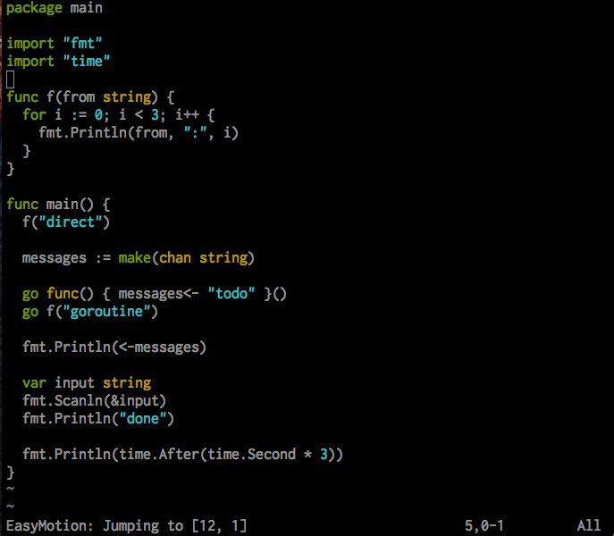
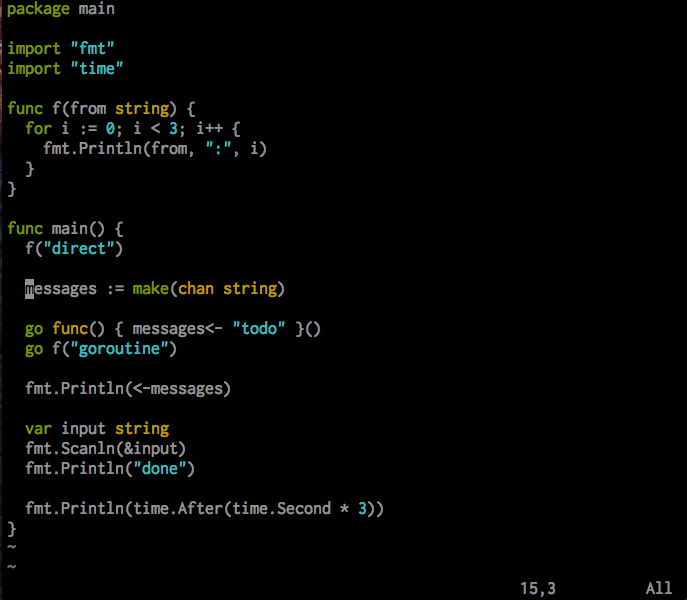
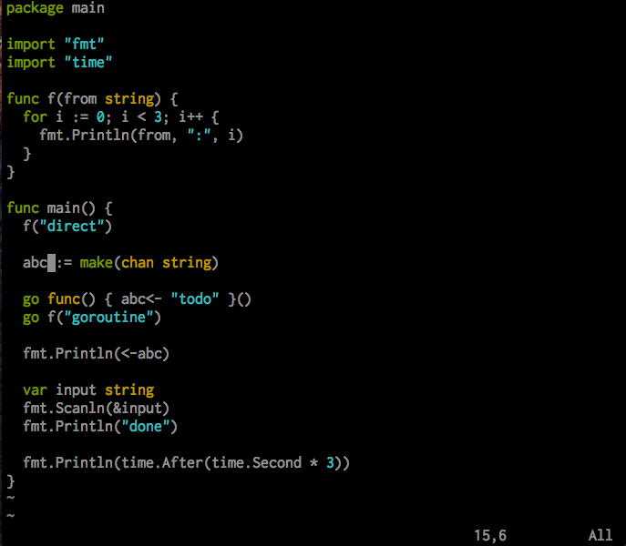
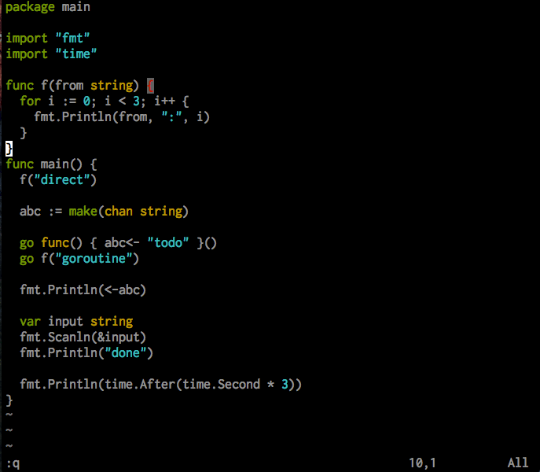
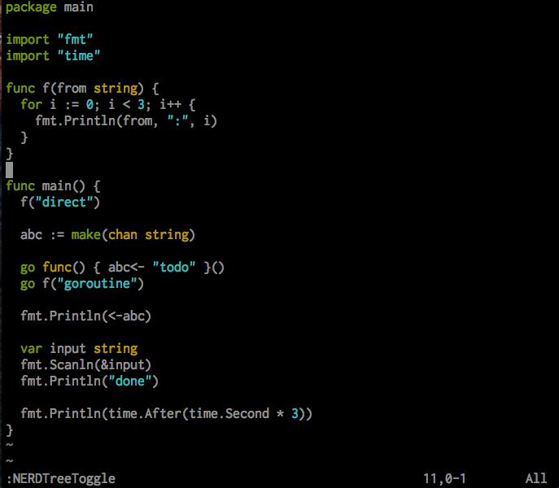

# vim_in_docker

A personal flavored vim run in a Docker container, it is a super fit for those virtual machines/servers have docker installed.

## Installation

    sudo -- sh -c "curl -LSso /usr/local/bin/vim http://bit.ly/vim_in_docker; chmod +x /usr/local/bin/vim"

[Demo](demo/installation.gif)

## Plugins Selection and Why

[List of Plugins](PLUGINS.md)

## Vim Frequently Used Key Bindings

### Movement Key Bindings

- [normal mode] `space then f` quick jump to any words in the screen 
- [normal mode] `space then r` rebuild ctags for current directory
- [normal mode] `ctrl and ]`  jump to definition, need to rebuild ctags first
- [normal mode] `ctrl and o` jump back to last cursor position
- [normal mode] `ctrl and i` jump back to next cursor position
- [normal mode] `space then space` jump to and jump back between the current editing file and the last edited file

### Selection Key Bindings

- [normal mode] `ctrl and n` press multiple times to select multiple current word and edit all of them at the same time 

### Comment Key Bindings

- [visual mode] `g then c` toggle comment

### Complete Key Bindings

- [insert mode] `tab` auto complete with next candidate
- [insert mode] `shift and tab` auto complete with previous candidate

### Alignment Key Bindings

- [visual mode] `enter then =` align selected lines by =
- [visual mode] `enter then :` align selected lines by :

### Windows Key Bindings

- [normal mode] `space then b` browse files, use `ctrl + j/k` to move between candidates 
- [normal mode] `space then w` split a new horizontal window to the left
- [normal mode] `space then W` split a new vertical window to the top
- [normal mode] `space then q` shortcut for :q
- [normal mode] `space then Q` shortcut for :q!  
- [normal mode] `space then t` toggle directory tree
- [normal mode] `space then T` open directory tree and select current editing file 
- [normal mode] `ctrl and h/j/k/l` move left/up/down/right among windows

### List Available Key Bindings

- `:map` all mode key mappings
- `:nmap` normal mode key mappings
- `:vmap` visual mode key mappings
- `:imap` insert mode key mappings

